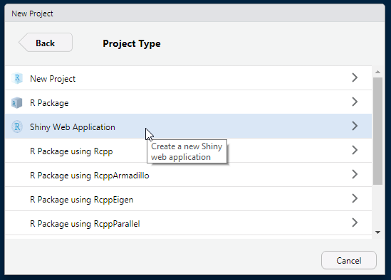
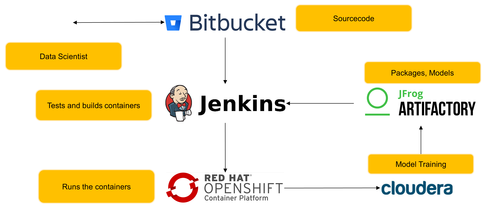

<style>
.forceBreak { -webkit-column-break-after: always; break-after: column; }
</style>


```{r setup, include=FALSE}
knitr::opts_chunk$set(echo = FALSE)
library(tidyverse)
library(shiny)
library(plotly)
```

## Content

- What is Shiny anyway?
- How does Shiny compare to...
- How does Shiny work?
- How to deploy Shiny?
- Examples

## Short introduction
```{r, echo=FALSE, out.width='15%', fig.align='center', fig.cap=''}

```


<div align = "center">Jens Hofmann</div>

<p class="forceBreak"></p><p class="forceBreak"></p>
```{r, echo=FALSE, out.width='15%', fig.align='center', fig.cap=''}


```

# *Shiny is an R package that makes it easy to build interactive web apps straight from R.*
Source: shiny.rstudio.com

# *Tableau is focused on one thing - helping people see and understand data.*
Source: tableau.com/solutions

## A short comparision {.columns-2 .smaller}

### Shiny
- is based on the R infrastructure
- can be used to make dashboards from your analysis 🌆
- can be a tool to explore models 🎉
- can run locally or as web app 🌅☁
- is fully integrated into R Studio
- is (mostly) free

<p class="forceBreak"></p>

### Tableau
- is a self-service BI suite with it own ecosystem 🎡
- enables non-programmers to generate reports 🤠
- integrates (somehow) with Python 🐍
- is (quite) pricy


## *How does Shiny work?*

## Shiny example
Most of the time you will start with some kind of analysis...

```{r, echo=FALSE, out.width='50%', fig.align='center', fig.cap=''}

```

## Shiny example
```{r, eval=TRUE, echo=TRUE}
ggplot(mpg, aes(displ, hwy, colour = class)) + geom_point()
```

## Shiny example
### A shiny app consists of two componentes:
```{r, eval=FALSE, echo=TRUE}
shinyApp(ui, server)
```

## Shiny example - The UI
### The UI holds the front-end elements:
```{r, eval=FALSE, echo=TRUE}
ui = fluidPage(
  selectInput("manufacturer", "Manufacturer:",
              choices = levels(as.factor(mpg$manufacturer))),
  plotOutput("mpgplot")
)
```

## Shiny example - By the way...
### Functions like fluidPage are basically HTML:
```{r, eval=FALSE, echo=TRUE}
fluidPage()
```
returns
```{r, eval=FALSE, echo=TRUE}
<div class="container-fluid"></div>
```

## Shiny example - The Server
### The Server function contains the back-end logic:
```{r, shinyserver, eval=FALSE, echo=TRUE}
server = function(input, output) {
    output$mpgplot = renderPlot({
        
        ggplot(mpg[mpg$manufacturer == input$manufacturer,], 
               aes(displ, hwy, colour = class)) + 
            geom_point()
    })
}
```

## Putting it all together
```{r, eval=FALSE, echo=TRUE}
library(shiny)
library(ggplot2)

shinyApp(
    ui = fluidPage(
        selectInput("manufacturer", "Manufacturer:",
                    choices = levels(as.factor(mpg$manufacturer))),
        plotOutput("mpgplot")
    ),
    server = function(input, output) {
        output$mpgplot = renderPlot({
            ggplot(mpg[mpg$manufacturer == input$manufacturer,], 
                   aes(displ, hwy, colour = class)) + 
            geom_point()
        })
    }
)
```

## Putting it all together
<iframe val = TRUE, echo=FALSE}
knitr::include_app("https://jehof.shinyapps.io/shiny_demo/")
```

#, height = "600px"# How to deploy Shiny Apps? {.columns-2 .smaller}

### Solutions by R Studio

#### shinyapps.io
 + userfriendly cloud service
 + mostly payed
 
#### Rstudio Server, Shiny Server, RStudio Connect:
 + on premise solutions
 + enterprise ready (LDAP, loadbalancing, ...)
 + mostly payed

<p class="forceBreak"></p>

### Custom solutions

#### ShinyProxy on Kubernetes
 + on premise solution
 + custom made
 + enterprise ready
 
#### OAuth2 with Shiny Server Proxy on Kubernetes
 + on premise solution
 + custom made
 + enterprise ready


## CI/CD Pipeline
```{r, echo=FALSE, out.width='100%', fig.align='center', fig.cap=''}

```

## Wrap-UP {.columns-2 .smaller}

- Shiny can be tremendously useful when you do your analysis in R
- You can build self-service BI Tools
- Deployment in R Studio Server, Shiny Server, Connect is quite easy
  - but it requieres special infrastructure
  - payed per user
- Deployment in a container platform with CI/CD pipeline can be done
  - but it's no free lunch

<p class="forceBreak"></p><p class="forceBreak"></p>

## Essential packages
| Package | Desc |
|------:|:-----|
| shiny | basepackage |
| ggplot2 | for graphs |
| plotly | for interactive graphs |
| r2d3 | integrate D3 visualizations into shiny |
| shinyWidgets | custom input widgets |
| shinycssloaders | custom loading animations 😅 |
| leaflet | for maps |

## Essential packages - dashboards
| Package | Desc |
|------:|:-----|
| shinydashboards | Bootstrap3 dashboard |
| bs4Dash | Bootstrap4 ftw! |
| shinymaterial | Material dashboard |

## Example homebreR by Dave Steps {.smaller}
```{r, homebreR, echo=FALSE}
knitr::include_app("http://davesteps.com/homebrewR")
```
 
## Example Stadtrad
```{r, stadtrad, echo=FALSE}
knitr::include_app("https://alexkruse.shinyapps.io/stadtrad")
```

## Thank you very much! {.columns-2 .smaller}
```{r, echo=FALSE, out.width='15%', fig.align='center', fig.cap=''}

```
<p class="forceBreak"></p><p class="forceBreak"></p>
Dr. Jens Hofmann

Lead Data Scientist CX, Marketing

Versicherungskammer


Email: jenshofmann@outlook.de

Twitter: @Je_Hofmann

